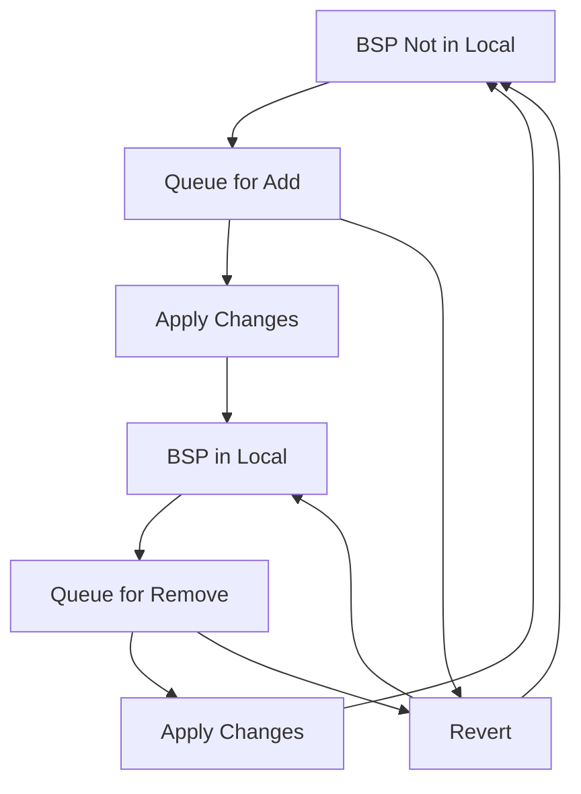

# LCSManager Design Document

## Overview

The **LCSManager** (Local Content Storage Manager) is a critical component of the MTBAssist VS Code extension that manages the local storage and synchronization of Board Support Packages (BSPs) for ModusToolbox projects. It serves as an interface between the VS Code extension and the ModusToolbox `lcs-manager-cli` tool, providing a user-friendly way to manage BSP downloads and updates.

## Architecture

### Class Hierarchy
```
EventEmitter
    └── LCSManager
```

The LCSManager extends Node.js EventEmitter to provide real-time updates to the UI about BSP operations, downloads, and status changes.

### Key Dependencies
- **ModusToolboxEnvironment**: For executing CLI commands and accessing tools
- **MTBAssistObject**: Parent extension object providing logging and environment access
- **lcs-manager-cli**: External CLI tool for actual BSP management operations

## Core Responsibilities

### 1. BSP State Management
- **Local BSP Tracking**: Maintains current state of BSPs in local storage
- **Queue Management**: Manages pending add/remove operations before applying changes
- **State Synchronization**: Keeps UI state in sync with actual local storage

### 2. CLI Integration
- **Tool Discovery**: Locates the lcs-manager-cli tool in ModusToolbox installation
- **Command Execution**: Executes BSP operations through the CLI tool
- **Output Parsing**: Processes CLI output to update internal state

### 3. Update Management
- **Update Detection**: Checks for available BSP updates
- **Batch Operations**: Supports bulk add/remove of all BSPs
- **Progressive Updates**: Handles one-by-one BSP operations

## Data Model

### Core State Properties

| Property | Type | Description |
|----------|------|-------------|
| `needsUpdate_` | boolean | Indicates if BSP updates are available |
| `original_` | string[] | Original BSP list (for revert functionality) |
| `bsps_` | string[] | Current BSPs in local storage |
| `toadd_` | string[] | BSPs queued for addition |
| `todel_` | string[] | BSPs queued for removal |
| `updates_` | Array<[string, string]> | Available updates (BSP name, version) |

### State Transitions



## API Design

### Public Interface

#### Properties (Getters)
- `needsApplyChanges`: Returns true if there are pending BSP changes
- `isLCSReady`: Returns true if local storage contains at least one BSP
- `needsUpdate`: Returns true if BSP updates are available
- `bspsIn`: Returns BSPs currently in local storage
- `toAdd`: Returns BSPs queued for addition
- `toDelete`: Returns BSPs queued for removal
- `bspsOut`: Returns BSPs available but not in local storage

#### Methods
- `updateNeedsUpdate()`: Checks for available BSP updates
- `updateBSPS()`: Refreshes the list of BSPs in local storage
- `command(data)`: Processes UI commands for BSP management

### Command Interface

The `command()` method supports the following operations:

| Command | Description | Parameters |
|---------|-------------|------------|
| `revert` | Reverts all pending changes | none |
| `togglebsp` | Toggles BSP add/remove state | `bsp`: BSP name |
| `update` | Updates existing BSP content | none |
| `check` | Checks for available updates | none |
| `apply` | Applies all pending changes | none |
| `moveAllToLocal` | Queues all BSPs for addition | none |
| `removeAllFromLocal` | Queues all BSPs for removal | none |

## Implementation Details

### BSP Toggle Logic

The toggle mechanism implements a sophisticated state machine:

1. **BSP Currently in Local Storage**:
   - If queued for addition → Remove from add queue, remove visually
   - Otherwise → Add to delete queue, remove visually

2. **BSP Not in Local Storage**:
   - If queued for removal → Remove from delete queue
   - Otherwise → Add to add queue, add visually

### CLI Command Execution

The manager uses a standardized pattern for CLI operations:

```typescript
private runLCSCmd(args: string[], cb?: callback): Promise<[number, string[]]>
```

- **Error Handling**: Checks exit codes and provides meaningful error messages
- **Output Capture**: Captures both stdout and stderr for processing
- **Progress Reporting**: Optional callback for real-time output streaming
- **Logging**: Comprehensive debug logging for troubleshooting

### Batch Operations

The manager optimizes BSP operations through intelligent batching:

- **Add All**: Uses `--add-all` when all BSPs are selected
- **Remove All**: Uses `--clear-all` when all BSPs are deselected  
- **Individual Operations**: Falls back to one-by-one processing for partial selections

## Event System

The LCSManager emits events to communicate with the UI:

| Event | Description | When Emitted |
|-------|-------------|--------------|
| `show` | Display CLI output | Before running CLI commands |
| `lcsdone` | Operation completed | After successful BSP operations |

## Error Handling

### Error Categories

1. **CLI Tool Not Found**: When lcs-manager-cli is not available
2. **Command Execution Failure**: When CLI commands return non-zero exit codes
3. **Output Parsing Errors**: When CLI output format is unexpected
4. **Network/Download Errors**: When BSP downloads fail (handled by CLI)

### Error Recovery

- **Graceful Degradation**: UI remains functional even when some operations fail
- **State Consistency**: Ensures internal state remains consistent on errors
- **User Feedback**: Provides clear error messages through promise rejections

## Performance Considerations

### Optimization Strategies

1. **Lazy Loading**: BSP lists are only updated when requested
2. **Batch Operations**: Multiple BSP operations are batched when possible
3. **Caching**: Original state is cached for efficient revert operations
4. **Event-Driven Updates**: UI updates are event-driven to avoid polling

### Memory Management

- **String Arrays**: Efficient storage of BSP names
- **Promise Management**: Proper cleanup of async operations
- **Event Listener Management**: Inherited from EventEmitter base class

## Security Considerations

### Input Validation
- **BSP Names**: Validated against known BSP list from manifest database
- **CLI Arguments**: Sanitized before passing to shell commands
- **Path Handling**: Safe path construction for tool discovery

### Privilege Management
- **Tool Execution**: Executes tools with user permissions only
- **File System Access**: Limited to ModusToolbox installation directories
- **Network Access**: Delegated to lcs-manager-cli tool

## Testing Strategy

### Unit Testing Focus Areas
1. **State Management**: Verify correct state transitions
2. **Command Processing**: Test all command types and edge cases
3. **CLI Integration**: Mock CLI responses for deterministic testing
4. **Error Handling**: Verify proper error propagation and recovery

### Integration Testing
1. **End-to-End Workflows**: Complete BSP add/remove cycles
2. **CLI Tool Integration**: Actual interaction with lcs-manager-cli
3. **UI Integration**: Event emission and UI state synchronization

## Future Enhancements

### Potential Improvements
1. **Progress Tracking**: More granular progress reporting for large BSP downloads
2. **Dependency Management**: Handle BSP dependencies automatically
3. **Caching Strategy**: Implement local caching of BSP metadata
4. **Parallel Downloads**: Support concurrent BSP downloads when possible
5. **Rollback Capability**: Ability to rollback failed BSP operations

### API Extensions
1. **BSP Metadata**: Expose BSP version information and descriptions
2. **Custom BSP Sources**: Support for custom BSP repositories
3. **Selective Updates**: Allow updating specific BSPs rather than all
4. **Export/Import**: BSP configuration export/import functionality

## Conclusion

The LCSManager provides a robust, user-friendly interface for managing ModusToolbox BSPs within VS Code. Its event-driven architecture, comprehensive error handling, and optimized batch operations make it suitable for both small-scale development and large enterprise environments. The design emphasizes reliability, performance, and maintainability while providing a solid foundation for future enhancements.